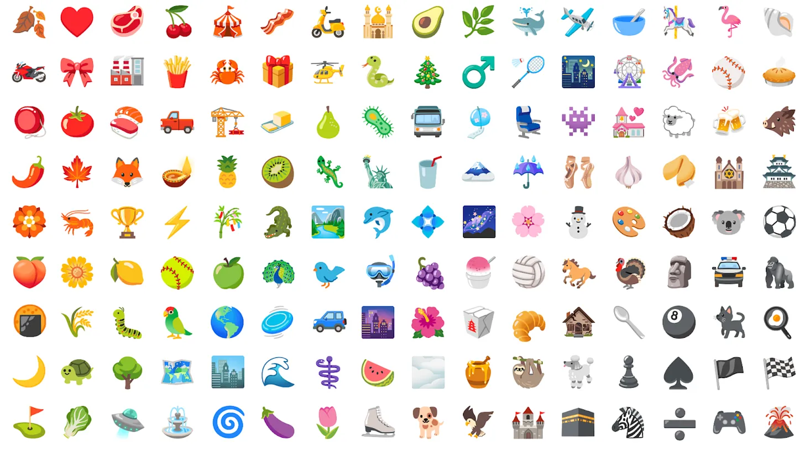

# Noto Emoji
Color and Black-and-White Noto emoji fonts, and tools for working with them.

## Building NotoColorEmoji

Building NotoColorEmoji requires a few files from nototools.  Clone a copy from
https://github.com/googlei18n/nototools and either put it in your PYTHONPATH or
use 'python setup.py develop' ('install' currently won't fully install all the
data used by nototools).  You will also need fontTools, get it from
https://github.com/behdad/fonttools.git.

Then run make.  NotoColorEmoji is the default target.  It's suggested to use -j,
especially if you are using zopflipng for compression.  Intermediate products
(compressed image files, for example) will be put into a build subdirectory; the
font will be at the top level.

## Using NotoColorEmoji

NotoColorEmoji uses the CBDT/CBLC color font format, which is supported by Android
and Chrome/Chromium OS, but not MacOS.  Windows supports it starting with Windows 10
Anniversary Update.   No Browser on MacOS supports it, but Edge (on latest Windows)
does.  Chrome on Linux will support it with some fontconfig tweaking, see
[issue #36](https://github.com/googlei18n/noto-emoji/issues/36). Currently we do
not build other color font formats.

## License

Emoji fonts (under the fonts subdirectory) are under the
[SIL Open Font License, version 1.1](fonts/LICENSE). 
Tools and most image resources are under the [Apache license, version 2.0](./LICENSE).
Flag images under third_party/region-flags are in the public domain or
otherwise exempt from copyright ([more info](third_party/region-flags/LICENSE)).

## Contributing

Please read [CONTRIBUTING](CONTRIBUTING.md) if you are thinking of contributing to this project.

## News

* 2015-12-09: Unicode 7 and 8 emoji image data (.png format) added.
* 2015-09-29: All Noto fonts now licensed under the SIL Open Font License.
